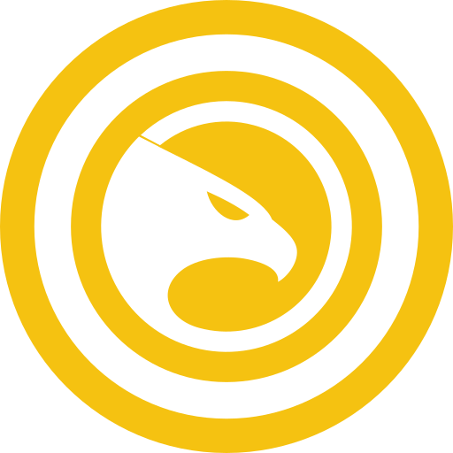

<div align="center">
  
  
# SafwaNetwork

  > **Decentralized MLM Smart Contract on Polygon**  
  > A transparent, immutable 5x10 matrix referral system with automated commission distribution.

  [](https://soliditylang.org/)
  [](https://opensource.org/licenses/MIT)
  [](https://solidityscan.com)
  
  **[🌐 Website](https://safwa.network)** | **[📱 DApp](https://safwa.network)** | **[📖 Docs](docs/)**
  
</div>

---

## 🌟 Overview

SafwaNetwork is a **fully decentralized MLM (Multi-Level Marketing) system** built on the Polygon blockchain. It enables transparent, automated commission distribution across 10 levels of referrals with no central authority after deployment.

### Key Features

✅ **Immutable & Trustless** - No admin controls, rules cannot be changed  
✅ **10-Level Commission** - Earn from up to 10 generations of referrals  
✅ **Automatic Spillover** - Network fills automatically when slots are full  
✅ **Role-Based Matrix** - Scalable from 5x10 to 30x10 based on role  
✅ **Founder-Centric** - Engineer deploys Founder, then loses all access  
✅ **Gas Optimized** - Efficient storage and operations  
✅ **Reentrancy Protected** - Secure against common attacks  

---

## 📊 How It Works

### Joining the Network

1. **Pay 25 USD** (in USD ≈ stablecoin) to join
2. **Get unique referral ID** for recruiting
3. **Earn commissions** from 10 levels of downline

### Commission Structure

When someone joins using your referral code, their 25 USD payment is distributed:

| Level | Commission | Amount |
|-------|-----------|--------|
| 1 (Direct) | 25% | 6.25 USD |
| 2 | 10% | 2.50 USD |
| 3 | 10% | 2.50 USD |
| 4 | 5% | 1.25 USD |
| 5 | 10% | 2.50 USD |
| 6 | 10% | 2.50 USD |
| 7 | 5% | 1.25 USD |
| 8 | 10% | 2.50 USD |
| 9 | 10% | 2.50 USD |
| 10 | 5% | 1.25 USD |

**Total: 25 USD (100% distributed)**

### Role Hierarchy

| Role | Matrix Size | Direct Referrals | Free Adds |
|------|------------|-----------------|-----------|
| Partner | 5x10 | 5 | 0 |
| Leader | 10x10 | 10 | 1 |
| CoFounder | 20x10 | 20 | 5 |
| Founder | 30x10 | 30 | 10 |

**Role Progression:**

- Join under Founder → Become CoFounder
- Join under CoFounder → Become Leader
- Join under Leader/Partner → Remain Partner

---

## 🏗️ Architecture

### Founder-Centric Model

SafwaNetwork uses a unique deployment model:

1. **Engineer** deploys the contract
2. Engineer creates the **Founder** (one-time action)
3. Engineer is **permanently locked out** (loses all access)
4. **Founder** becomes the sole authority

### Founder Benefits

- **100% Fund Wallet** - All taxes and fees
- **Default Upline** - Receives commissions from missing upline slots
- **30 Direct Referrals** - Maximum network capacity
- **10 Free Adds** - Can add members without payment

---

## 💰 Earnings & Withdrawals

### SDOLLAR (Internal Token)

- **Not tradeable** - Cannot be sold on DEXs
- **Tracks earnings** - Internal accounting only
- **Withdrawable** - Convert to USD ≈ anytime

### Withdrawal Requirements

- Minimum balance: **5 SDOLLAR**
- Minimum referrals: **3 active members**
- Tiered tax structure:
  - ≤100 SDOLLAR: 1 SDOLLAR flat fee
  - 100-1,000: 1%
  - 1,000-10,000: 0.1%
  - withdrawings > 10,000: 0.01%

---

## 🔒 Security

### Audit Results

- **Security Score:** 62.31/100 (SolidityScan - Latest)
- **Lines Analyzed:** 815
- **Critical Issues:** 2 (False Positives - DAI-specific)
- **High Issues:** 0
- **Medium Issues:** 2 (Acknowledged, intentional design)

### Security Features

✅ **ReentrancyGuard** - All state-changing functions protected  
✅ **Access Control** - Role-based modifiers (Engineer/Founder)  
✅ **Input Validation** - Comprehensive checks on all inputs  
✅ **DAI Deposit Protection** - `rescueExcessDAI` with mathematical safeguards  
✅ **Immutable Core Logic** - No upgradability, no backdoors  
✅ **Anti-DoS** - Exact placement (no gas-heavy loops)  
✅ **Event Tracking** - Full transparency via blockchain events  

---

## 📁 Repository Structure

```
SafwaNetwork/
├── contract/
│   └── SafwaNetwork.sol              # Main smart contract (815 lines)
├── docs/
│   ├── en/                           # English Documentation
│   │   ├── legal/                    # Legal Framework (10 documents)
│   │   │   ├── Terms_Of_Service.md
│   │   │   ├── Privacy_Policy.md
│   │   │   ├── AML_Policy.md
│   │   │   ├── Income_Disclaimer.md
│   │   │   ├── Risk_Disclosure.md
│   │   │   ├── Security_Audit.md
│   │   │   ├── Cookie_Policy.md
│   │   │   ├── Law_Enforcement_Policy.md
│   │   │   ├── Marketing_Code.md
│   │   │   └── Brand_Guidelines.md
│   │   ├── technical/                # Technical Documents
│   │   │   ├── Whitepaper.md
│   │   │   ├── Technical_Guide.md
│   │   │   └── Security_Audit.md
│   │   ├── guides/                   # User Guides
│   │   │   ├── Onboarding_Guide.md
│   │   │   ├── Simple_Explanation.md
│   │   │   ├── FAQ.md
│   │   │   └── Brand_Guidelines.md
│   │   └── help/                     # Help Center
│   │       ├── index.md              # Help Hub
│   │       ├── tutorials/            # Step-by-step guides
│   │       │   ├── How_To_Join.md
│   │       │   ├── How_To_Earn.md
│   │       │   └── How_To_Withdraw.md
│   │       ├── wallets/              # Wallet Setup Guides
│   │       │   ├── Binance_Guide.md
│   │       │   ├── MetaMask_Guide.md
│   │       │   ├── TrustWallet_Guide.md
│   │       │   └── Coinbase_Wallet_Guide.md
│   │       └── education/            # Crypto Education
│   │           ├── What_Is_Blockchain.md
│   │           ├── What_Is_Polygon.md
│   │           ├── What_Is_DAI.md
│   │           ├── What_Is_Smart_Contract.md
│   │           └── What_Is_Crypto_Wallet.md
│   └── ar/                           # Arabic Documentation (Full Mirror)
│       └── [Same structure as /en]
└── README.md                         # This file
```

---

## 🚀 Deployment

### Prerequisites

- Solidity 0.8.33
- Polygon PoS network
- USD ≈ token address: `0x8f3Cf7ad23Cd3CaDbD9735AFf958023239c6A063`

### Deployment Steps

1. **Deploy Contract**

   ```solidity
   SafwaNetwork safwa = new SafwaNetwork();
   // Engineer ID: 0x1000100000
   ```

2. **Deploy Founder** (one-time, Engineer only)

   ```solidity
   safwa.deployFounder(founderAddress);
   // Founder ID: 0x1000100001
   // Engineer now locked out permanently
   ```

3. **Network Ready**
   - Founder can start adding members
   - Partners can join via referral codes

---

## 📖 Documentation

### 🎓 For Users

- **[Help Center](docs/en/help/index.md)** - Start here for tutorials and guides
- **[Simple Explanation](docs/en/guides/Simple_Explanation.md)** - What SafwaNetwork does
- **[FAQ](docs/en/guides/FAQ.md)** - Frequently asked questions
- **[Onboarding Guide](docs/en/guides/Onboarding_Guide.md)** - Revenue tables and earnings

### 🔧 For Developers

- **[Technical Guide](docs/en/technical/Technical_Guide.md)** - Complete code walkthrough
- **[Whitepaper](docs/en/technical/Whitepaper.md)** - Economic model & mathematics
- **[Security Audit](docs/en/technical/Security_Audit.md)** - Security analysis

### ⚖️ Legal Framework

- **[Terms of Service](docs/en/legal/Terms_Of_Service.md)** - Independent Contractor model
- **[Privacy Policy](docs/en/legal/Privacy_Policy.md)** - Data minimization statement
- **[Risk Disclosure](docs/en/legal/Risk_Disclosure.md)** - Total loss warnings
- **[All Legal Docs](docs/en/legal/)** - Complete legal suite (10 documents)

### 🌍 Translations

- **Arabic:** Full documentation mirror in `docs/ar/`

---

## 🔧 Key Functions

### Public Functions

```solidity
// Join the network (pay 25 USD ≈)
function join(uint64 _parentReferralId) external

// Withdraw SDOLLAR as USD ≈
function withdraw() external

// Transfer SDOLLAR between partners
function transferSdollarByReferral(uint64 _toReferralId, uint256 _amount) external
```

### Founder Functions

```solidity
// Add partner for free (role-based limits: 10 max)
function addPartnerForFree(address _wallet, uint64 _parentReferralId, Role _role) external

// Distribute Fund wallet (100% to Founder)
function distributeFund() external

// Rescue accidentally sent tokens (DAI blocked)
function rescueTokens(address _token, uint256 _amount) external

// Rescue excess DAI only (protects user deposits mathematically)
function rescueExcessDAI(uint256 _amount) external
```

### View Functions

```solidity
// Get partner info by ID
function getPartnerByReferral(uint64 _id) external view returns (PartnerView memory)

// Get partner info by address
function getPartnerByAddress(address _addr) external view returns (PartnerView memory)

// Get direct referrals
function getDirectReferrals(uint64 _id) external view returns (uint64[] memory)

// Get upline array
function getPartnerUpline(uint64 _id) external view returns (uint64[11] memory)
```

---

## ⚠️ Important Notes

### For Partners

1. **SDOLLAR is NOT tradeable** - Only withdrawable as USD ≈
2. **Minimum requirements** - 5 SDOLLAR + 3 referrals to withdraw
3. **Withdrawal is permanent** - SDOLLAR is burned
4. **Spillover is automatic** - Network fills even when you're full

### For Developers

1. **Immutable contract** - No upgradability, test thoroughly
2. **Gas optimization** - Uses efficient storage patterns
3. **Event tracking** - All actions emit events for off-chain monitoring
4. **No external dependencies** - Self-contained (except USD ≈ token)

### Legal Disclaimer

This is experimental software. Use at your own risk. The contract is immutable and cannot be modified after deployment. Earnings depend entirely on network growth. This is not financial advice.

---

## 📊 Network Statistics

### Theoretical Maximum (5x10 Matrix)

- **Total Network:** 11,718,750 people
- **Maximum Earnings:** 18,212,125 USD per person
- **Levels:** 10 generations deep

### Realistic Scenario (3 referrals average)

- **Total Network:** 88,572 people
- **Expected Earnings:** 144,795 USD per person
- **Growth Rate:** Conservative

---

## 🤝 Contributing

This is an immutable smart contract. Once deployed, the code cannot be changed. However, documentation improvements and bug reports are welcome.

### Reporting Issues

- Security issues: Please report privately
- Documentation: Open a GitHub issue
- Questions: Use GitHub Discussions

---

## 📜 License

This project is licensed under the MIT License - see the [LICENSE](LICENSE) file for details.

---

## 🔗 Links

- **Contract Address:** TBD (after deployment)
- **Polygon Explorer:** TBD
- **Documentation:** [docs/](docs/)
- **Audit Report:** SolidityScan Score 95.81/100

---

## 📞 Contact

For partnership inquiries or technical questions, please open a GitHub issue.

---

## ⭐ Acknowledgments

Built with:

- Solidity 0.8.33
- OpenZeppelin patterns (ReentrancyGuard)
- Polygon PoS network
- USD ≈ DAI stablecoin

---

**SafwaNetwork** - Decentralized MLM, Transparent Commissions, Immutable Rules 🚀
